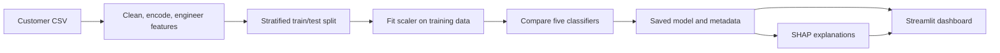
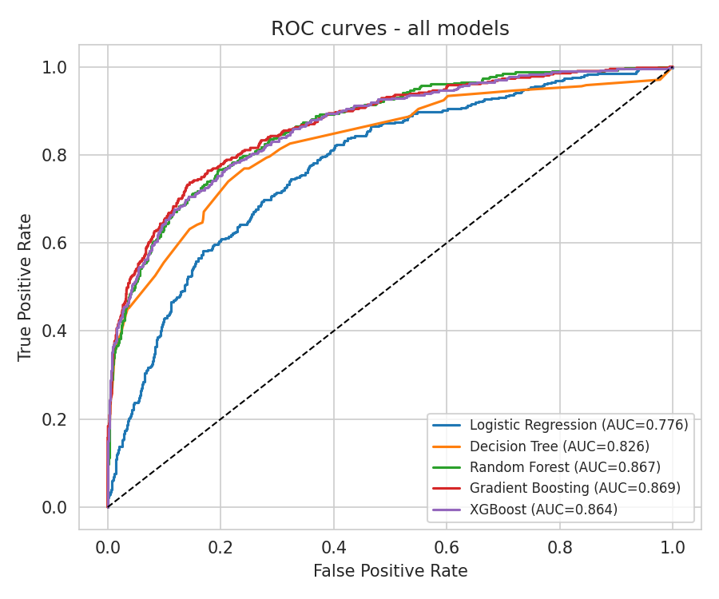
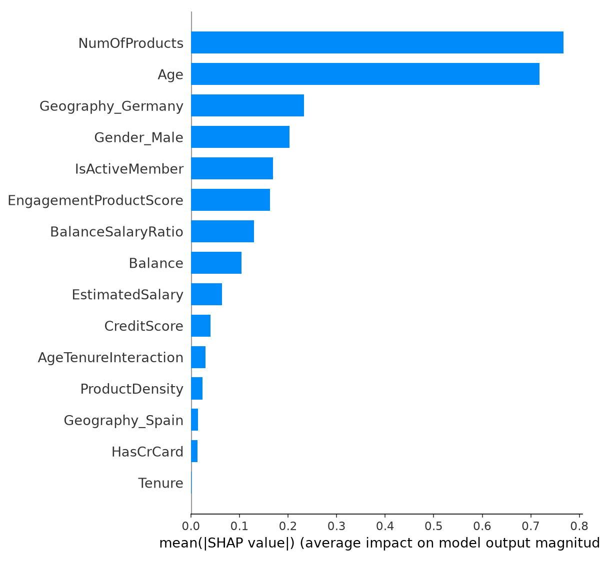

# Bank Customer Churn — ML & Explainability Dashboard

A Python and Streamlit project that turns bank customer records into churn-risk estimates, model comparisons and explanations. Developed by **Pathlavath Shiva Kumar** during the Data Analyst internship at **Unified Mentor Pvt. Ltd.**

## Problem and approach

Customer-retention analysis needs both a risk estimate and a way to understand it. This project prepares tabular customer data, compares five classifiers and exposes the selected model through an interactive dashboard. Predictions are an analytical prototype, not measured retention outcomes.

## What is implemented

- Data cleaning, categorical encoding and four engineered features: balance-to-salary ratio, product density, engagement-product score and age-tenure interaction.
- A stratified 80/20 split, with numeric scaling fitted on the training partition.
- Logistic regression, decision tree, random forest, gradient boosting and XGBoost models.
- Accuracy, precision, recall, F1 and ROC-AUC evaluation, with model selection by ROC-AUC.
- SHAP explanations and a Streamlit interface for a risk calculator, score distribution, feature importance and what-if exploration.

## Architecture



**Stack:** Python, Pandas, NumPy, scikit-learn, XGBoost, SHAP, Matplotlib, Streamlit and Joblib.

## Repository structure

```text
app/app.py             Interactive dashboard
data/European_Bank.csv Input dataset
src/data_prep.py        Reusable preparation and scaling
src/train_model.py      Training, evaluation and model selection
src/explain.py          SHAP analysis and plots
models/                Saved models, scaler, feature names and metrics
outputs/               Generated analysis figures
notebooks/EDA.ipynb     Exploratory analysis
```

## Run locally

Run commands from the repository root. Use a virtual environment and install the listed dependencies.

```bash
git clone https://github.com/shivakumar9121/bank-churn-dashboard.git
cd bank-churn-dashboard
python -m venv .venv
# Windows: .venv\Scripts\activate
# macOS/Linux: source .venv/bin/activate
pip install -r requirements.txt
python src/train_model.py
python src/explain.py
streamlit run app/app.py
```

The app opens at the local URL printed by Streamlit. Retrain artifacts in your environment if the checked-in serialized models are incompatible with installed library versions. Only load model files from a source you trust.

## Analysis previews

These are existing figures generated by the project, not mockups.




## Results and limits

The repository contains experiment metrics in `models/metrics.json` and model-comparison plots in `outputs/`. The same test partition is used to compare and select models, so the recorded scores are not an independent final assessment. No claim is made about production users, customer-retention uplift or business impact.

Next steps are a separate validation/final-test protocol, cross-validation, calibration checks and pinned dependency versions. The what-if interface shows model sensitivity, not a causal effect of changing customer behavior.

## Links

- [Source repository](https://github.com/shivakumar9121/bank-churn-dashboard)
- [LinkedIn](https://www.linkedin.com/in/pathlavath-shiva-kumar-441517321/)

